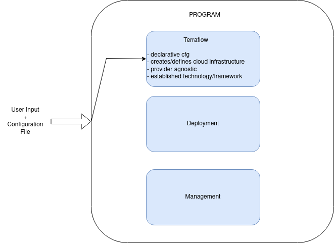

# Proposal

After reading the previously mentioned [Containers in HPC: a survey](https://link.springer.com/article/10.1007/s11227-022-04848-y) that
reviewed 93 works arond 2013 - 2022, as well as several other works, I think I finally have a more robust proposition to our collaboration.

## 1. Context/Summary
- Problems to be addressed in HPC:
    - __Application Portability and Dependency Resolution__
    - __Scientific Reproducibility__
- Containers as attempted solution, issues were:
    - __performance__  overhead of container technology
    - __security__ issues (admin priveleges needed to execute, such as in the case for Dockers)
    - __the execution model__ of containers at the time.
- State-of-the-art:  
    - Newer, __HPC-specific containers__ were developed better suited to the paradigm. (Singularity, Shifter, etc)
    - __Performance loss__ is often negligable or mostly small for all types of overhead, if
    containers allow some form of vendor/platform-specific utilization of SW and HW tools. Examples 
    would be allowing access to specialized network interconnects, GPU accelerators or specialized libraries for the 
    current platform present in the system.
    - There is a tradeoff: __Performance x Portability__.
- Takeaway:  
    - Performance minimization/benchmarking already robustly investigated (CPU, GPU, Network, etc).
    - Hard to "move the needle" or attempt something novel in that context.
    - Some effort has been done on portability of different workflows.
    - Little has been done on __portability between dedicated HPC systems and cloud platforms__.
    
## 2. Premise

The effective distribution of complex software packages and their dependencies, both within a research group and to 
the wider community, is challenging and time consuming. Especially, considering many of the research fields that benefit 
from large computational infrastructures and/or HPC facilities do not have expertise knowledge required to efficiently 
build, package and deploy complex software on unconventional hardware systems. 

It is difficult to justify the researcher time required to do so on esoteric, wide-ranging and sometimes 
even un-maintained platforms, from laptops to HPC facilities to cloud computing infrastructures. 

The __Cloud__ both public and commerical is an engineering infrastructure that 
has been available for decades now and is for the most part cost-efficient, scalable, and more
accessible to both smaller and larger research teams. As previously alluded to, 
little work was done to display the portability of these containers across these two systems. Working 
towards solutions that enable flawless transitions between both can also help with prototyping, fast deployments 
and better sharing of results.

References of work that attempt to close the gap between HPC-Cloud infrastructures: 
- [Enabling the execution of HPC applications on public clouds with HPC@Cloud toolkit](https://onlinelibrary.wiley.com/doi/full/10.1002/cpe.7976)
- [10 Years Later: Cloud Computing is Closing the Performance Gap](https://dl.acm.org/doi/abs/10.1145/3447545.3451183)

Containers in HPC: Survey (2016 - 2022):
- [Containers in HPC: a survey](https://link.springer.com/article/10.1007/s11227-022-04848-y)

Singularity: 
- [Singularity: Scientific containers for mobility of compute](https://journals.plos.org/plosone/article?id=10.1371/journal.pone.0177459)

## 3. Proposal

Based on the following facts/work:

1. [SingularityCE Version 4.0](https://docs.sylabs.io/guides/4.0/user-guide/oci_runtime.html), released as of September 2023,
now fully supporting the [OCI-Standard](https://opencontainers.org/) via the `--oci` flag. This greatly enhances 
the flexibility and usability of the tool. Allowing user's to pull, run and build most containers on Docker Hub 
without changes. Giving an access to a wide array of container images/ecosystems already avaiable in public repositories, as well 
as make use of these base-images for new containers.

2. [HPC@Cloud toolkit](https://onlinelibrary.wiley.com/doi/full/10.1002/cpe.7976) published on December 4th 2023 on a early 
version of the _Concurrency and Computation: Practice and Experience_ journal. Also, already available as an open source project on [Github](https://github.com/lapesd/hpcac-toolkit) 
under the [Apache License 2.0](https://github.com/lapesd/hpcac-toolkit/blob/main/LICENSE).

Based on their toolkit idea (2) and the current state of containers such as singularity(1) and docker, I wish to develop an 
open-source tool leveraging containerization that builds, deploys and manages workflows on different cloud providers as 
well as HPC facilities of choice.

However with a simpler, cleaner and more extensible design such that it can be easily integrated in 
more real-world Cloud/HPC workflows. Ideally, it's small enough to be robust, tight and precise; as well as 
large enough to actually provide muscle or help in making research deployment and prototyping much easier.

#### Design:

- __Goals__: _(broadly)_
    - `Infrastructure as Code (IaC)` to enable version controllable and automated workflows.
    - Containerize a given HPC application:
        - Docker 
        - Singularity 
        - ( Potentially OCI-conformant ) Unikernels
    - Deployment of simulation on Cloud (Google, AWS, IBM, etc) or HPC system of choice
    - Management of said deployment 
    - Return result/data and gather relevant metadata from simulation/deployment.

- __Language:__ `Golang` 
    + Portable and Compiled 
    - Easy hosting/distribution 
    - Built-in concurrent programming
    + [Docker](https://www.docker.com/) and [Singularity](https://sylabs.io/singularity/) are written in `golang`, as well as offer library bindings as well.
    + Hashicorp's [Terraform ](https://www.terraform.io/) offers several [libraries](https://github.com/hashicorp/terraform-plugin-go) in golang.
    + Amazon Webservices also offer a [Golang SDK](https://aws.amazon.com/sdk-for-go/)

- __Workflow__: _(Work in Progress)_

- __Feature Differences__:

<table>
<tr>
    <th>HPC@Cloud Toolkit</th>
    <th>Proposed Project</th>
</tr>
<tr>
    <td>
    <ul>
        <li>Python</li>
        <li>Separate Modules/Tools:
        <ul> 
            <li>CLI Module</li>
            <li>Resource Manager Module</li>
            <li>Cost Prediction Module</li>
            <li>Job Manager Module</li>
            <li>Metadata Collection Module</li>
        </ul>
        </li>
        <li> Supports:</li>
        <ul> 
            <li>Amazon AWS</li>
            <li>Vultr Cloud</li>
        </ul>
    </ul>
    </td>
    <td>
    <ul>
        <li>Golang</li>
        <li>Single Binary</li>
        <li>Containerization (OCI) workflows</li>
        <ul> 
            <li>Singularity</li>
            <li>Docker</li>
            <li>Unikernels (Possibly if OCI Compatible)</li>
        </ul>
        <li>Builds, Deploys and Manages</li>
        <li>Gathers Data and Metadata</li>
        <li>
        Potentially support:
        <ul> 
            <li>HPC System (LRZ/TUM)</li>
            <li>IBM Cloud</li>
            <li>Google Cloud Platform</li>
            <li>Amazon AWS</li>
        </ul>
        </li>
    </ul>
    </td>
</tr>
</table>

#### Evaluation/Methodology:

1. Development.
2. Benchmark Applications:
    - Run equally on: 
        + Cloud  services (low-end instance --eight vCPUs)
        + HPC facility. 
    - Gather benchmarking data.
        - Simulation time  
        - Startup time  
        - Containerization time
    - Benchmarks: 
        + [NPB](https://www.nas.nasa.gov/software/npb.html), a well known suite of HPC Benchmarks from the NAS divistion
        + Parallel Solver Implementation of Laplace's Heat Diffusion Equations

## 4. Wrap-up

Finally, given: 
- Prof. Franke's extensive background, especially in and around HPC/MPI 
- Prof. Carsten's field of research heavily centered around HPC/Parallel Computing 
- Open works at Prof. Carsten's chair by Prof. Schulz ( 
[1](https://www.ce.cit.tum.de/fileadmin/w00cgn/caps/pdf/BAMA-Characterization-of-Benchmarks-Network.pdf), 
[2](https://www.ce.cit.tum.de/fileadmin/w00cgn/caps/pdf/BAMA-Characterization-of-Benchmarks-Memory.pdf),
[3](https://www.ce.cit.tum.de/fileadmin/w00cgn/caps/pdf/BAMA-Characterization-of-Benchmarks-IO.pdf) 
), indicate that this __work/tool could be of use to the chair or even ongoing research!__
- Even openly extended to include OCI-compliant Unikernels as a container technology if relevant for HPC.

I believe that the venn diagramm of interests, capability, and feasability of this work is well closed! 
